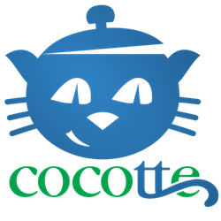

<p style="margin:0;padding:0" id="cocotte" align="center">

</p>

[](https://travis-ci.org/chrif/cocotte) 
[](https://codecov.io/gh/chrif/cocotte)
[](https://codeclimate.com/github/chrif/cocotte/maintainability)
[](https://scrutinizer-ci.com/g/chrif/cocotte/?branch=master)

Cocotte aims at easing the learning curve for web developers starting with cloud hosting and application containerization. You get a basic and [affordable](#pricing) installation, allowing you to focus on your project(s) first, and learn about your infrastructure later:

* [Docker](https://www.docker.com/) containers for all processes.
* [Digital Ocean](https://www.digitalocean.com/) as the cloud provider.
* [Traefik](https://traefik.io/) as the reverse proxy for hostname routing and SSL certificates automation.

## Requirements

* A Mac or Linux operating system.
* Docker (including Docker Compose and Docker Machine).
* A Digital Ocean account.
* A domain name using the name servers of Digital Ocean.

## Installation

* Install [Docker](https://docs.docker.com/install/).
* Linux only: install [Docker Compose](https://docs.docker.com/compose/install/).
* Install [Docker Machine](https://github.com/docker/machine/releases).
* If you don't have a Digital Ocean account, create one with [this link](https://m.do.co/c/c25ed78e51c5) and you will get a 100$ credit.
* Generate a [Digital Ocean API token](https://cloud.digitalocean.com/settings/api/tokens) with write permissions.
* Make sur you have a domain whose name servers are set to:
	 * ns1.digitalocean.com
	 * ns2.digitalocean.com
	 * ns3.digitalocean.com

## Usage

* Run the [`wizard`](installer/docs/console.md#wizard).
	```
	$ docker run -it --rm chrif/cocotte wizard
	```
* Display help for the [`install`](installer/docs/console.md#install) command.
	```
	$ docker run -it --rm chrif/cocotte install --help
	```
* [More usages](installer/docs/console.md)

## Reference

* [Console API Reference](installer/docs/console.md)
* [The `machine` directory](docs/machine.md)

## Pricing

If you already have a Digital Ocean account, then you probably know about cloud pricing. For those who don't, you are charged $0.007/hour by Digital Ocean for the machine that Cocotte creates. So just testing Cocotte and then destroying the machine costs less than 1 cent. Keeping the machine online for a month costs 5$. 

[Read about Digital Ocean pricing](https://www.digitalocean.com/pricing/).
